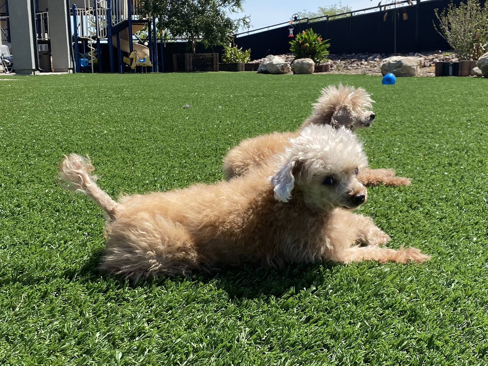
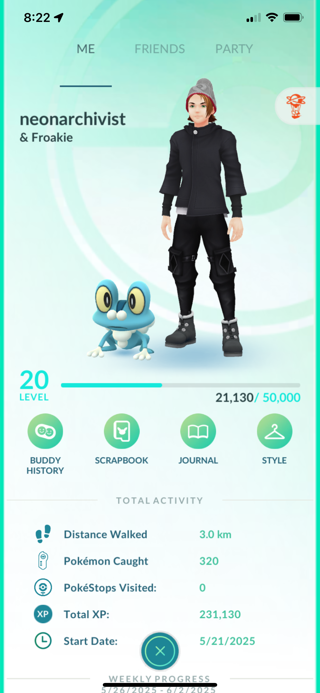
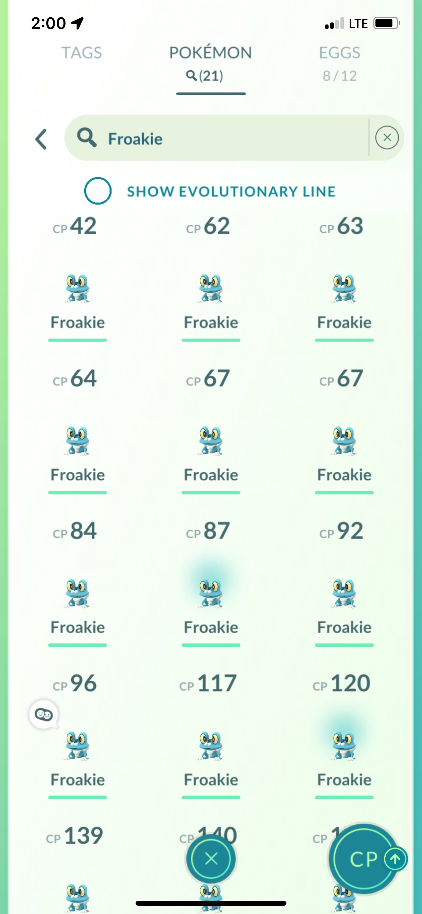
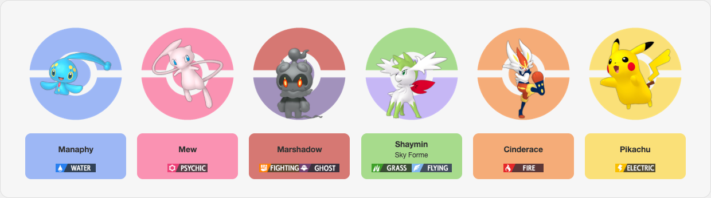
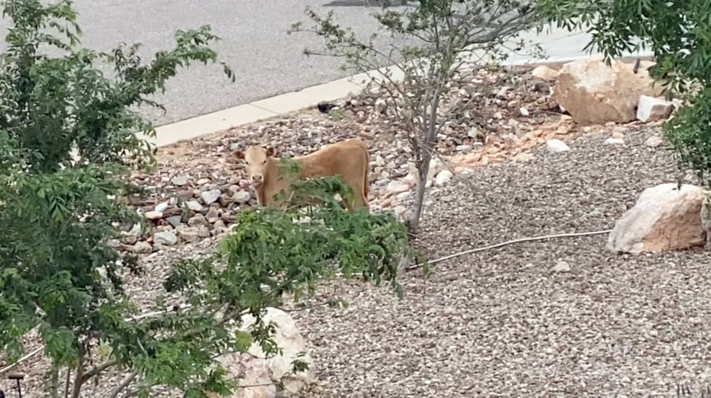
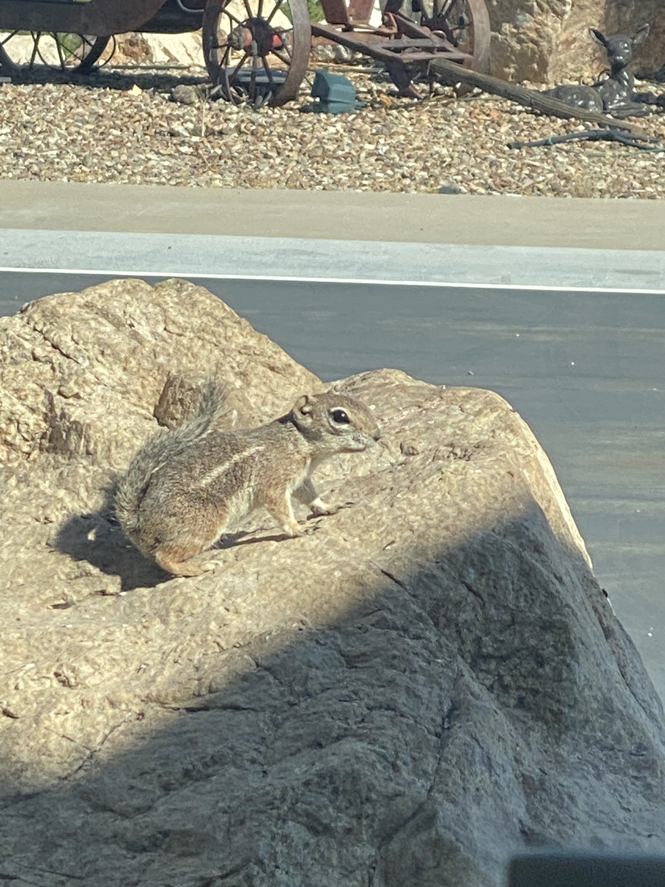
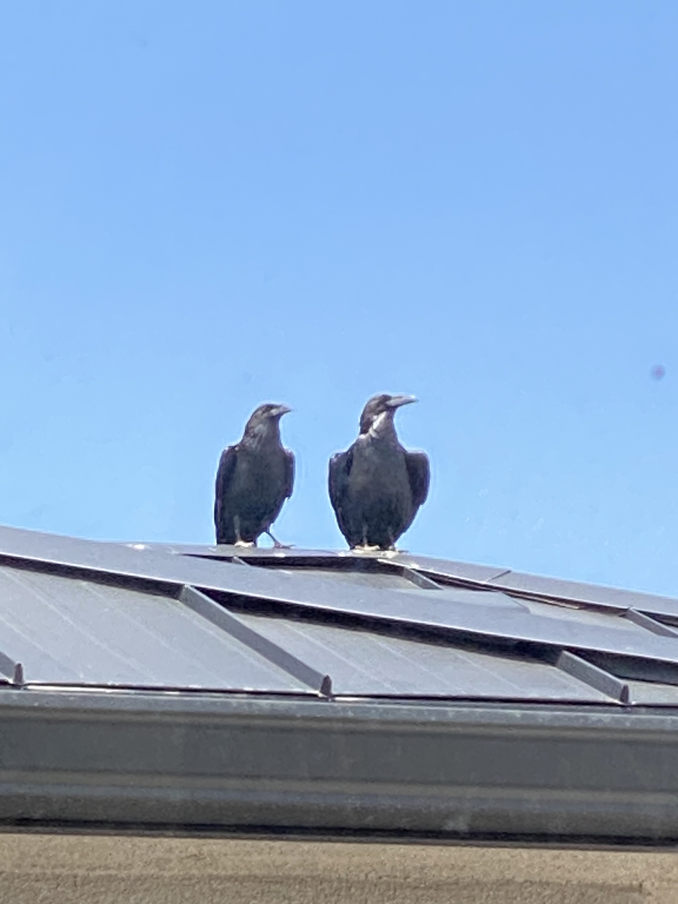
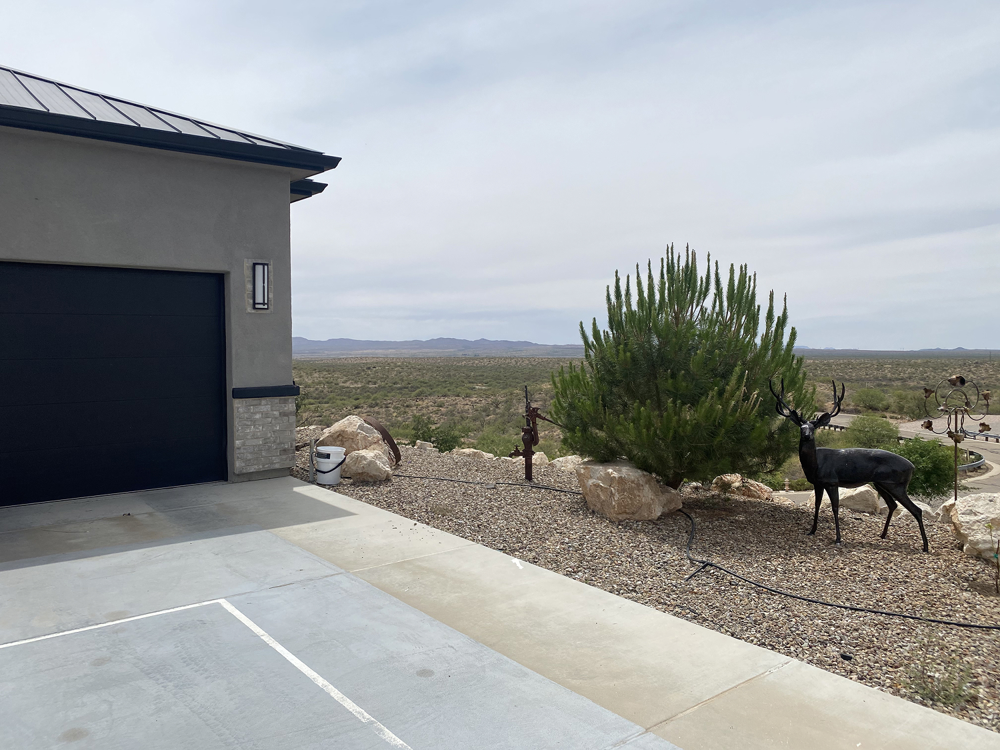

# Pokémon GO: A Solo Survival Guide

🗓️ **May 2025**  
📍 **Tucson, Arizona**

I'm house-sitting for my parents while they’re off at the Ironman in Hawaii. It’s just me, four poodles (two red toy, two standard), a wildfire (aka Cody Fire) nearby that shut down half the roads, and the echo of the desert in every direction.

  
_Echo’s the one showing off his tail. Ariel’s lurking behind, as usual._

  
_Baloo the guardian. Big heart, big bark, bigger naps._

Somewhere between preparing a talk on emotional AI and caring for dogs in the middle of nowhere, I picked up Pokémon GO again. No gyms. No PokéStops. Just cactus, dust, Froakies... and this oddly perfect feeling that _something here wants to be caught._

So I made this guide.  
For you.  
For me.  
For anyone wandering — geographically or otherwise.

---

> _“Fast is fine, but accuracy is everything.” — Wyatt Earp_

You’ll want to remember that. Especially out here. Especially when you're playing slow, with no real plan. Accuracy isn't about catching every Pokémon. It's about catching the right ones — the ones that bring you joy. And maybe not stepping on a rattlesnake.

---

## 🧭 What This Guide _Actually_ Is

- A cheatsheet for minimalists and wanderers
- A philosophy journal in disguise
- A survival guide for when there’s no gym in sight
- A way to remember: you’re allowed to play differently

---

## 🐾 Getting Started When the Closest PokéStop Is a Mirage

- You don’t need to swipe a PokéStop to play
- You don’t need friends or raids or spreadsheets
- You just need one moment — one Froakie, maybe — to feel something

I got to Level 20 without spinning a single stop.  
Just walking. Catching. Thinking.

  
_Started from scratch. No stops. Just sand, stars, and Froakies._

---

## 🧼 A Minimalist’s Box Strategy (a.k.a. Don’t Keep 3,000 Pokémon)

Start with 500 storage max. Even 300 is fine.

**Use tags instead of clutter. Your system. Your rules.**

| Tag         | Purpose                                        |
| ----------- | ---------------------------------------------- |
| ⭐️ PowerUp | High IV or sentimental — might invest later    |
| ❤️ Keep     | No logic. You love them. That's enough         |
| 🧼 Review   | Check later when you're in a clearer headspace |
| ⚔️ PvP      | Good Great League stats or vibes               |
| ⬇️ Transfer | No tag = goodbye. No guilt                     |

I still haven’t swiped a single stop, so I can’t even see IVs yet — and yes, that means I’m Level 20 with **zero app functionality**.  
Call it _desert mode._  
Call it commitment.  
Either way, I’m not transferring anything until I get that first swipe. 😅

  
_Proof that Froakie runs this town. (Or at least my dusty backyard.)_

---

## 🔎 IVs & The Tucson Rule

Here’s the truth: you probably won’t get perfect Pokémon out here.  
You’ll get desert warriors. Dust-covered survivors. Froakies with attitude.

So forget the 4-stars.  
Just ask yourself:

- Do I like em?
- Will I use em?
- Is it better than 5 others I already have?

If yes, tag it. If not, let it go. Stardust is gold. Don’t spend it emotionally.

---

## 🧢 What to Buy (and What to Skip)

You’re solo. Be smart. Be stingy. Be intentional.

| Buy It                               | Skip It                             |
| ------------------------------------ | ----------------------------------- |
| Pokémon Storage (x3)                 | Stickers                            |
| Item Bag Upgrade                     | Avatar clothes (unless roleplaying) |
| Star Piece (for events)              | Lucky Eggs (early game)             |
| Incubators (if walking 5km+ per day) | Lures (unless testing a theory)     |

No shame in buying coins if gyms aren’t nearby.  
Just remember: coins don’t make a journey. Stories do.

---

## 🧪 Solo IV Philosophy (Tucson Mode)

- 4⭐ = Rare, but not required
- 3⭐ = Great
- 2⭐ = Totally usable
- 1⭐ = Consider transfer unless they’re a _vibe_

The game gives you what it gives you.  
Perfect doesn’t always mean useful. And vice versa.

---

## 🐉 Building a Dream Team to Strive For

No pressure. No metas. Just love.

- Pick your six
- Stick with them a while
- Rotate when your heart says so

I'm pretty sure Groudon has gotta live in Tucson, right? Sharing my dream team below for fuel to keep me going.

_A vision of the future. No meta, just vibes._

Also, here are some not-Pokémon: I went searching for a Tauros and found real cows.  
That still counts.

  
_Wrong Tauros, but she had the stats of a legend. Looked me dead in the eye and kept chewing._

  
_False alarm: not a chipmunk, just a desert squirrel cosplaying as Pachirisu.._

  
_They’re always together. Not sure what Pokémon they are — maybe Corviknight soulmates._

---

## 🏅 Optional Desert Achievements

These are optional, fun milestones to make you smile. Customize as needed.

- 🌵 **Level 20, No Swipes** — Who needs PokéStops anyway?
- 🐄 **Wrong Tauros** — Spot a cow IRL while looking for one in-game
- 🐸 **Froakie Whisperer** — Catch 10 Froakie in the wild
- 🥵 **Heatstroke Survivor** — Played for 30+ minutes in 95°F+
- 🧠 **Philosopher Trainer** — Had a real existential moment during incense
- 🔭 **Strange Biome** — Find a Pokémon wildly out of place (e.g. snow Pokémon in a desert)
- 🔥 **Dream Team Visionary** — Choose 6 core Pokémon and tag them

---

## 🏆 Long-Term Achievements (a.k.a. Bragging Rights)

These aren’t required. They won’t show up in your journal.  
But if you hit one? You’ll _know_.

| Achievement                 | Description                                                                      |
| --------------------------- | -------------------------------------------------------------------------------- |
| 🧊 **Excellent Mastery**    | Land 10 Excellent Throws in a row (no pressure, just scouts honor)               |
| 🧬 **All Eeveelutions**     | Collect or evolve all 8 Eeveelutions, your way                                   |
| 🦜 **Galarian Encounter**   | Encounter any Galarian bird — caught or not, you earned the story                |
| 💎 **Master Ball Secured**  | Obtain a Master Ball, even if you never use it                                   |
| 🌍 **Real-Life Pokédex**    | Spot 10 real animals that resemble Pokémon (cow = Tauros, chipmunk = Pachirisu?) |
| 🥷 **Tier 3 Solo**          | Win a Tier 3 raid solo — prep, dodge, and grit required                          |
| 🤝 **Community Builder**    | Make 10 friends through Pokémon GO or local meetups                              |
| 🌐 **Regional Tracker**     | Obtain 2 regional Pokémon — trades count, effort matters                         |
| 😬 **Buddy Redemption Arc** | Pair with your least favorite Pokémon for 7 days — see if they grow on you       |

These aren’t about flexing.  
They’re about _meaning_. Memory. Challenge. Humor.  
Pick the ones that speak to you — and feel free to add more as your journey grows.

---

## 🔋 Bonus Survival Notes

- Catch everything. It’s all Stardust.
- Use berries sparingly. Pinap the ones you want more of.
- Use Incense when walking, or sitting still pretending to be a cactus
- Don’t dump Rare Candy unless you're 100% sure
- Keep Poké Balls. Trust me, you’ll forget to check

---

## 🌄 Final Thought from a Solo Player

This isn’t just about Pokémon.  
It’s about how you move through the world. Quietly. Intentionally. Maybe without a clear path, but with just enough trust to follow curiosity.

  
_No gyms. No PokéStops. Just space to think, and maybe catch a shadow in the dust._

So if you find yourself out here — literally or emotionally — remember:

- You’re not broken for playing solo
- You’re not late for starting again
- You’re just catching what matters, one Froakie at a time

---

🪶 Written from the edge of the desert  
🐾 May 2025 — Tucson, AZ  
🐕 For the four poodles and the Pokémon that found me

---

## 🤝 Want to Add Your Story?

This guide is personal — but it’s not just mine.  
If something here made you smile, or if you’ve got your own desert journey (literal or not), feel free to fork, remix, or contribute.

## Whether it’s a new achievement, a survival tip, or a Froakie sighting you’ll never forget — you’re welcome here.

## ⚖️ License

This project is licensed under the MIT License.

---

## 🧰 Bonus Resources (For the Strategists)

Want to go a bit deeper? These tools are solo-friendly and easy to use:

- [PvPoke Rankings](https://pvpoke.com/) — See what thrives in Great League
- [Poké Steal or Deal](https://pokestealordeal.com/en) — Decide what’s worth keeping
- [Stadium IV Rank Checker](https://www.stadiumgaming.gg/rank-checker) — Optimize your PvP stats
- [Pokebattler](https://www.pokebattler.com/) — Plan for raids, even solo
- [Regional Pokémon List](https://pokemongohub.net/post/guide/regional-pokemon-list/) — See what spawns where (like Comfey in Hawaii)

Totally optional. Totally helpful. Use what works for your style.
